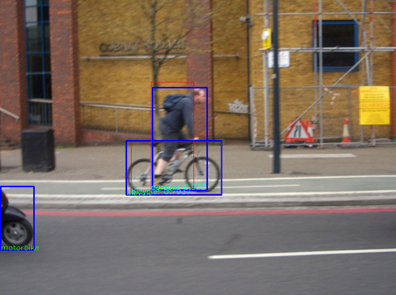
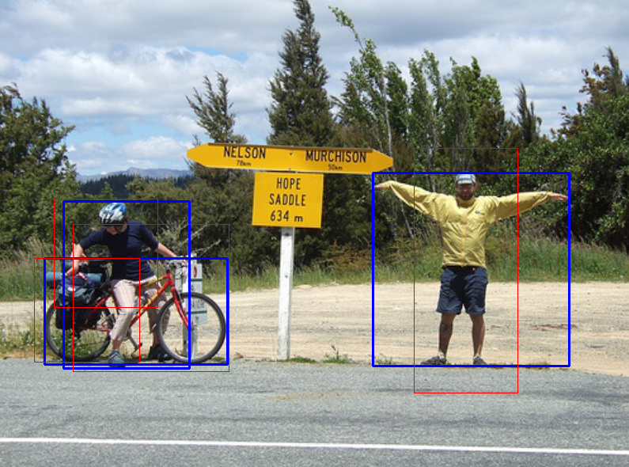
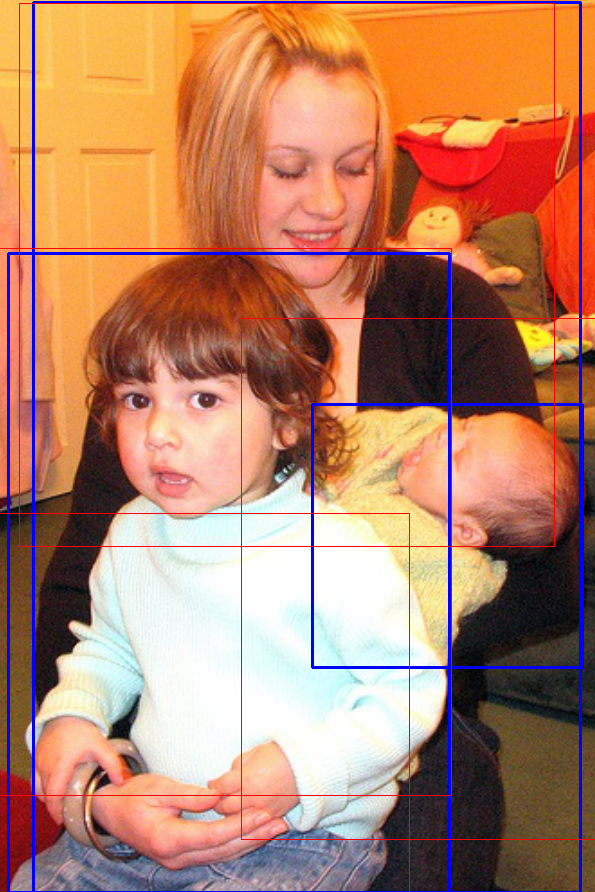

Yet Another MXnet DETection(ya_mxdet)
=====
*ya_mxdet* provides a simple Faster R-CNN
(proposed in [Faster R-CNN](https://arxiv.org/abs/1506.01497))
implementation **fully in MXNet [gluon](http://gluon.mxnet.io) API**. More functions are in developing.

*ya_mxdet* is not exactly the re-implementation of Faster R-CNN. You may need 
to tune it carefully for your tasks.

## Dependency
*ya_mxdet* depends on MXNet 0.11 with GPU support. 

 Refer to 
<https://mxnet.incubator.apache.org/get_started/install.html> for more details.

OpenCV is also required. [Installation from source](http://docs.opencv.org/master/d7/d9f/tutorial_linux_install.html) is highly recommended, since in the repo of some linux distribution OpenCV does not support *imshow()*.

## Run the model
Before you train a model, you need to prepare Pascal VOC 2007 dataset. You can 
download it from <http://host.robots.ox.ac.uk/pascal/VOC/>. Then set a soft 
link *VOC2007Train* pointing to *VOCdevkit/VOC2007*.

You also need a GPU with at least 11GB memory. The code may download VGG16 
pretrained model at the first run.
<pre>
$ mkdir model_dump
$ python3 train_faster_rcnn.py
</pre>

## Test the model
Currently only a visualization tool is finished. You can watch the detection 
result with 
<pre>
$ python3 test_faster_rcnn.py [model file]
</pre>

## Other issues
All the code are distributed with a MIT-style license. If you use this repo in your research, it would be nice to cite the original Faster R-CNN paper and add the link of this project into your report.

## Sample examples
In following samples, the blue boxes are the ground truth while the red boxes 
are the detection result. 
### RCNN Demo
Only the boxes with scores higher than 0.5 are shown in the demo. 

### RPN Demo
Only 4 boxes after NMS are shown in the demo.

